# Payment-system

Система для централизованной аутентифицкации пользователей, использующий Keycloak, для предоставления пользователям
следующего функционала:

- Регистрация пользователя
- Логин
- Обновление токена
- Получение информации о текущем пользователе
- Поиск пользователя по идентификатору
- Поиск пользователей по электронной почте
- Обновление пользователя
- Удаление пользователя
- Создание кошелька
- Просмотр кошелька
- Поиск кошельков клиента
- Пополнение кошелька
- Перевод денежных средств
- Вывод денежных средств
- Статус транзакции
- Поиск транзакции по параметрам

---

## Регистрация пользователя

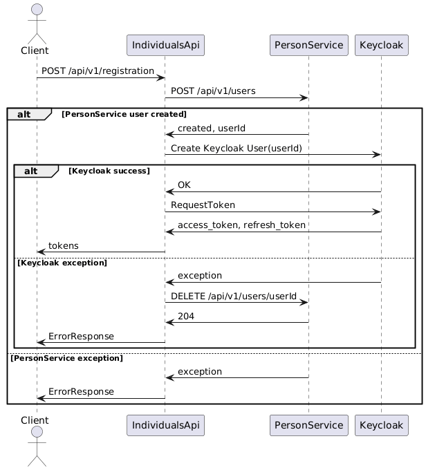

## Логин

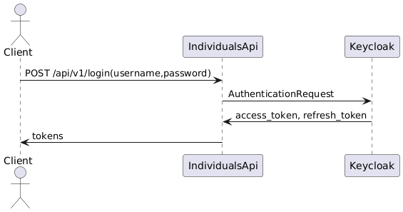

## Обновление токена

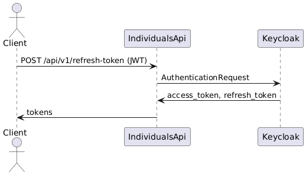

## Получение информации о текущем пользователе

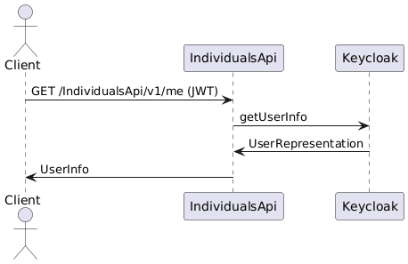

## Поиск пользователя по идентификатору

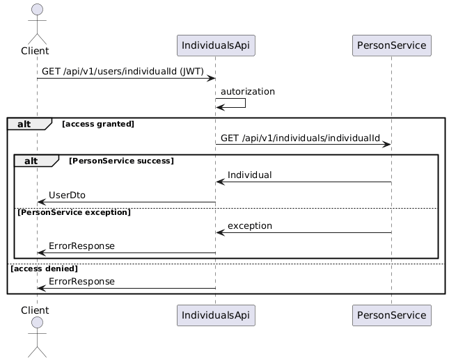

## Поиск пользователей по электронной почте

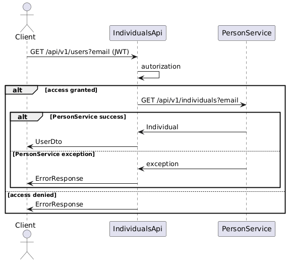

## Обновление пользователя

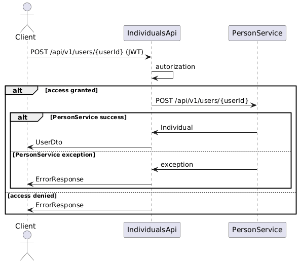

## Удаление пользователя

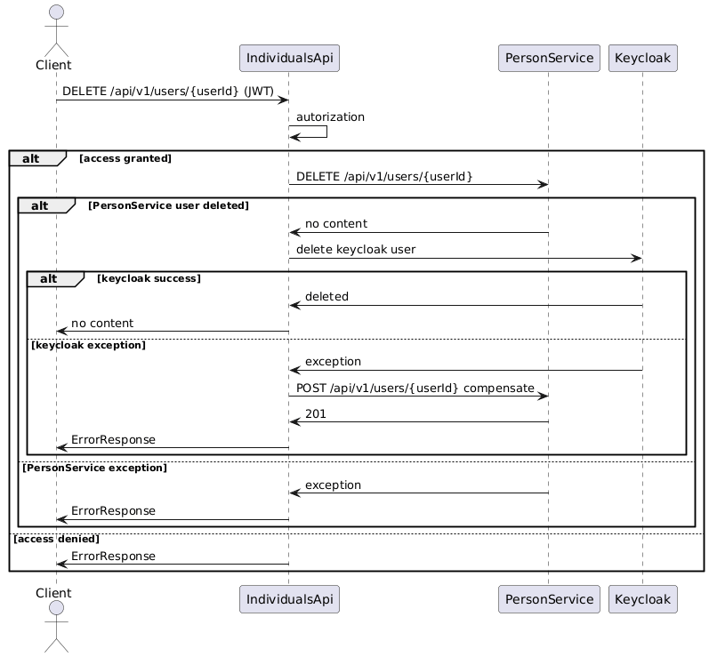

## Создание кошелька

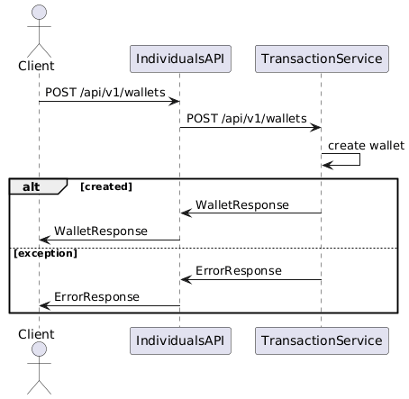

## Просмотр кошелька

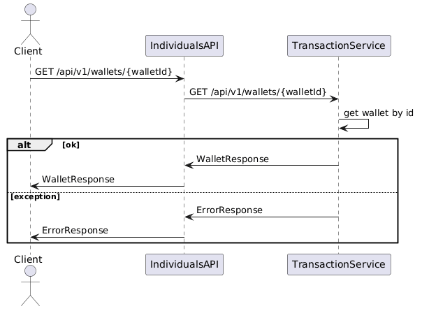

## Поиск кошельков клиента

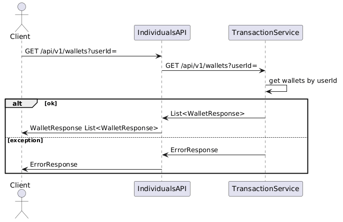

## Пополнение кошелька

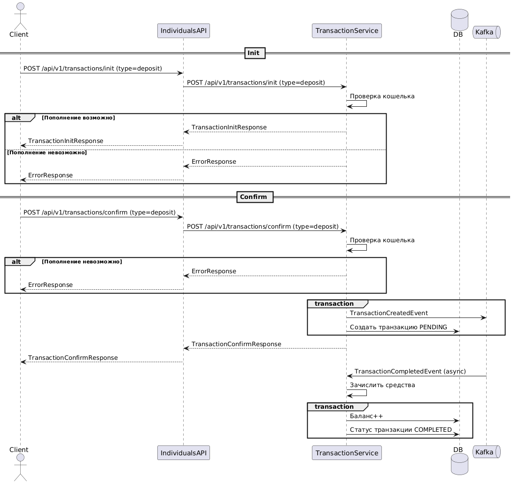

## Перевод денежных средств

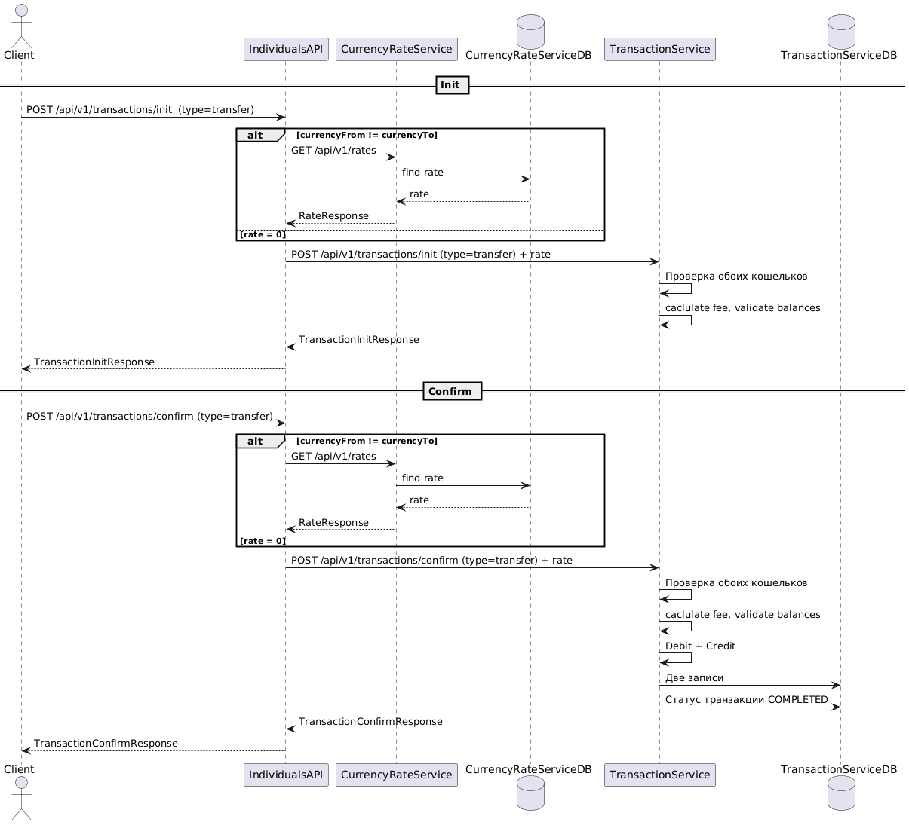

## Вывод денежных средств

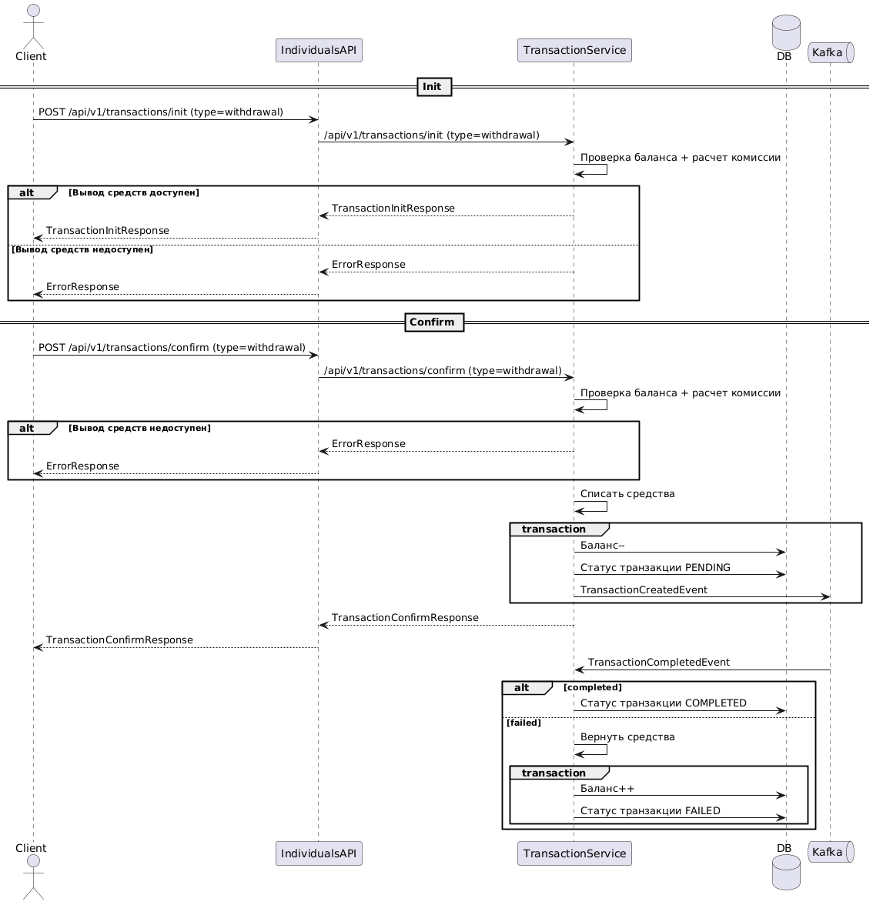

## Статус транзакции

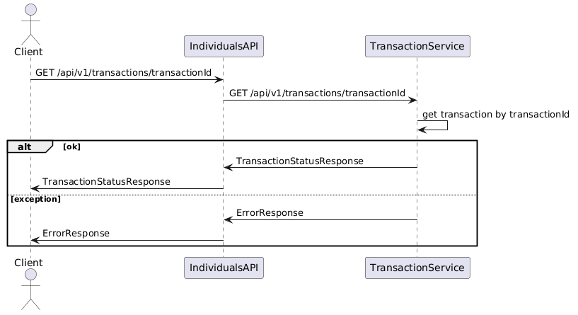

## Поиск транзакции по параметрам

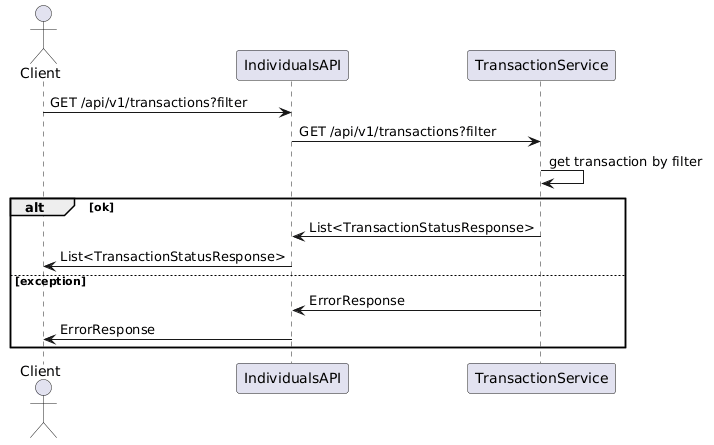
---

## Для запуска проекта необходимо:

### C помощью Makefile:

- Выполнить команду``make all``
- Для просмотра логов выполнить команду ```make infra-logs```
- Для остановки сервисов выполнить команду ```make down```

### Альтернативный вариант:

- Запустить Nexus, выполнив команду ```docker-compose up -d nexus```
- Зайти в Nexus http://localhost:8800 под учеткой администратора (admin,admin) и принять соглашение
  EULA(для более новых версий nexus)
- Выполнить билд person-service командой ```docker-compose build person-service --no-cache```
- Запустить все оставшиеся сервисы ```docker-compose up -d```
- Для просмотра логов выполнить команду ```docker-compose logs -f --tail=200```
- Для остановки сервисов выполнить команду ```docker-compose down -v```

---

## Порты сервисов

| Сервис                | Порт  | Описание                                              |
|-----------------------|-------|-------------------------------------------------------|
| Nexus                 | 8800  | Maven Репозиторий                                     |
| Keycloak              | 8080  | Сервис аутентификации                                 |
| Keycloak-Postgres     | 5433  | БД для Keycloak                                       |
| Alloy                 | 12345 | Сбор метрик и логов                                   |
| Prometheus            | 9090  | Хранилище метрик                                      |
| Loki                  | 3100  | Хранилище логов                                       |
| Tempo                 | 3200  | Хранилище трассировок                                 |
| Grafana               | 3000  | Визуализация метрик трейсов и логов                   |
| Person-service        | 8082  | Сервис пользователей                                  |
| Person-db             | 5434  | БД для Person-service                                 |
| Individuals-api       | 8081  | Сервис взаимодействия с системой Payment System       |
| Transaction-service   | 8083  | Сервис платежных операций                             |
| Transaction-db1       | 5435  | БД для Transaction-service(шард0)                     |
| Transaction-db2       | 5436  | БД для Transaction-service(шард1)                     |
| Transaction-db3       | 5437  | БД для Transaction-service(шард2)                     |
| Currency-Rate-Service | 8084  | Сервис Валют, инстанс 1                               |
| Currency-Rate-Service | 8085  | Сервис Валют, инстанс 2                               |
| Currency-Rate-Service | 8086  | Сервис Валют, инстанс 3                               |
| Nginx                 | 8000  | Nginx для балансировки запросов Currency-Rate-Service |
